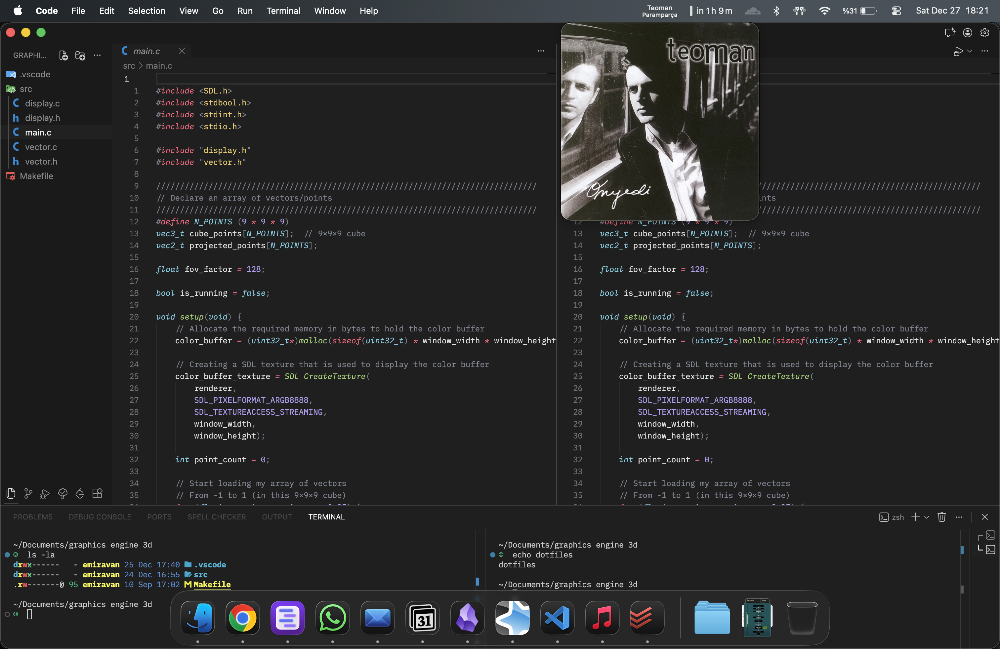
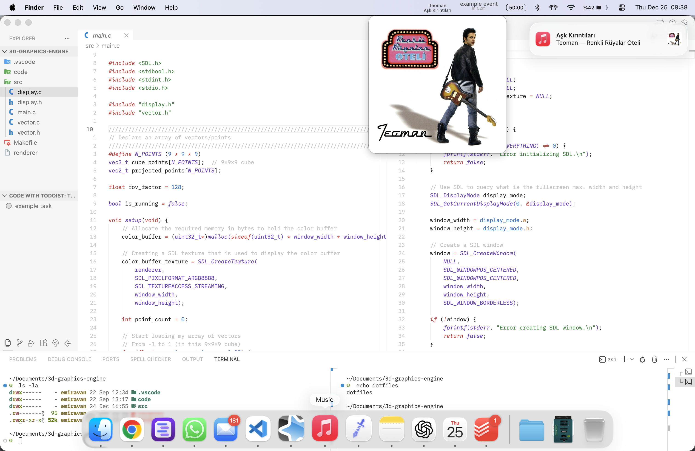
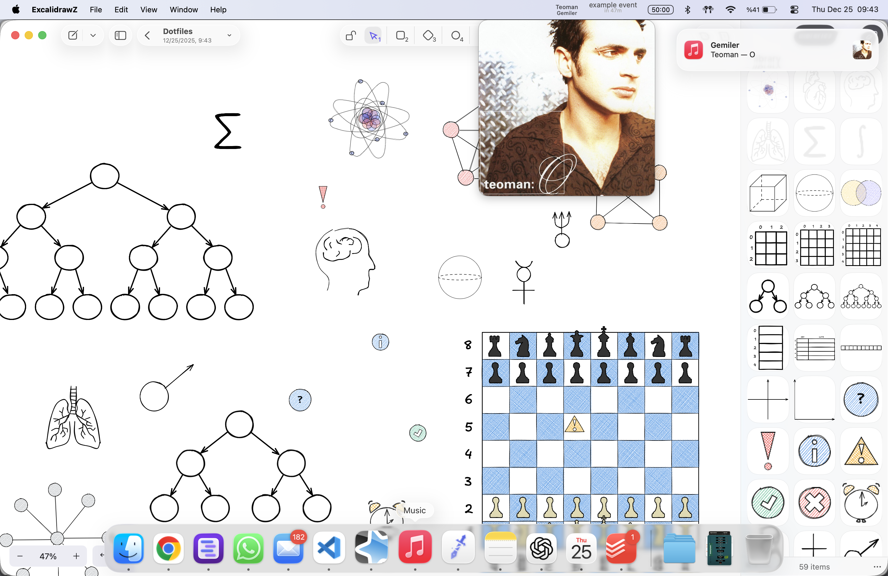

# Dotfiles




## 1. 🛠 Prerequisites

### Oh My Zsh

```bash
sh -c "$(curl -fsSL [https://raw.github.com/ohmyzsh/ohmyzsh/master/tools/install.sh](https://raw.github.com/ohmyzsh/ohmyzsh/master/tools/install.sh))"

```

### Homebrew

```bash
/bin/bash -c "$(curl -fsSL [https://raw.githubusercontent.com/Homebrew/install/HEAD/install.sh](https://raw.githubusercontent.com/Homebrew/install/HEAD/install.sh))"

```

---

## 2. 📦 Packages

### Homebrew Packages

#### CLI Tools

* **[eza](https://github.com/eza-community/eza)** — Modern replacement for `ls`.
* **[fzf](https://github.com/junegunn/fzf)** — Command-line fuzzy finder.
* **[yazi](https://github.com/sxyazi/yazi)** — Terminal file manager.
* **[yt-dlp](https://github.com/yt-dlp/yt-dlp)** — YouTube video downloader.
* **[zoxide](https://github.com/ajeetdsouza/zoxide)** — Smarter `cd` command.
* **[syncthing](https://syncthing.net/)** — File synchronization between devices.
<details>
<summary><b>To Start Syncthing:</b></summary>

> 
> ```bash
> brew services start syncthing
> ```
> Then access it at [`localhost:8384`](http://localhost:8384)

</details>

#### Project Dependencies

*The following packages are mainly used for my personal projects involving C++/OpenGL development:*

* **[cmake](https://cmake.org/)** — Build automation tool.
* **[glew](http://glew.sourceforge.net/)** — OpenGL Extension Wrangler Library.
* **[glow](https://github.com/grovesNL/glow)** — Cross-platform OpenGL bindings.
* **[sdl2](https://github.com/libsdl-org/SDL)** — Simple DirectMedia Layer 2.
* **[sdl2_image](https://github.com/libsdl-org/SDL_image)** — Image loading library for SDL2.

> **To Install All:**
> ```bash
> brew install cmake eza fzf glew glow sdl2 sdl2_image yazi yt-dlp zoxide syncthing
> 
> ```
> 
> 


---

### Homebrew Cask Applications

* **[blip](https://blip.net)** — Cross platform file transfer.
* **[cloudflare-warp](https://1.1.1.1/)** — VPN.
* **[discord](https://discord.com/)** — Voice and text chat for communities.
* **[font-lilex-nerd-font](https://github.com/mishamyrt/Lilex)** — [IBM Plex Mono](https://www.ibm.com/plex/) with nerd icons and ligatures.
* **[google-chrome](https://www.google.com/chrome/)** — Browser.
* **[iina](https://iina.io/)** — Media player.
* **[keka](https://www.keka.io/)** — File archiver for macOS.
* **[logi-options+](https://www.logitech.com/en-us/software/logi-options-plus.html)** — Logitech customization.
* **[microsoft-excel](https://www.microsoft.com/en-us/microsoft-365/excel)** — Spreadsheet.
* **[microsoft-powerpoint](https://www.microsoft.com/en-us/microsoft-365/powerpoint)** — Presentation.
* **[microsoft-word](https://www.microsoft.com/en-us/microsoft-365/word)** — Word processor.
* **[middleclick](https://middleclick.app/)** — Middle mouse button via trackpad.
* **[visual-studio-code](https://code.visualstudio.com/)** — Code editor.
* **[whatsapp](https://www.whatsapp.com/download)** — Messaging.
* **[fliqlo](https://fliqlo.com/)** — Flip clock screensaver.
* **[spotmenu](https://formulae.brew.sh/cask/spotmenu)** — Music player in the menu bar.
* **[todoist](https://todoist.com/)** — Task management.
* **[obsidian](https://obsidian.md/)** — Knowledge base and note-taking application.
* **[chatgpt](https://openai.com/chatgpt/)** — AI assistant.

> **To Install All:**
> ```bash
> brew install --cask blip cloudflare-warp discord font-lilex-nerd-font google-chrome iina keka logi-options+ microsoft-excel microsoft-powerpoint microsoft-word middleclick visual-studio-code whatsapp fliqlo spotmenu todoist-app obsidian chatgpt
> 
> ```
> 
> 

---

### App Store Applications

* **[Texty](https://apps.apple.com/us/app/texty-for-google-messages/id1538996043?mt=12)** — Google Messages client.
* **[Rcmd App Switcher](https://apps.apple.com/us/app/rcmd-app-switcher/id1596283165?mt=12)** — App switcher via right command key.
* **[Zoho Notebook](https://apps.apple.com/us/app/notebook-notes-to-do/id1173152781?mt=12)** — For quick notes in menubar.

---

## 3. ⚙️ Dotfiles

### Clone Repository

```bash
git clone [https://github.com/emiravan/dot-files.git](https://github.com/emiravan/dot-files.git)
cd dot-files

```

### Zsh Configuration

```bash
cp .zshrc ~/.zshrc
source ~/.zshrc

```

### VS Code Settings

```bash
cp Library/Application\ Support/Code/User/settings.json ~/Library/Application\ Support/Code/User/settings.json
cp Library/Application\ Support/Code/User/keybindings.json ~/Library/Application\ Support/Code/User/keybindings.json

```

### Cleanup

```bash
cd .. && rm -rf dotfiles

```

---

## 4. ️⌘ Rcmd Keys

[Rcmd App Switcher](https://apps.apple.com/us/app/rcmd-app-switcher/id1596283165?mt=12) provides press right Command (⌘) + custom key to switch applications

| Key(s) | Application | Description |
| :--- | :--- | :--- |
| `⌘+c` | Calendar | [C]alendar |
| `⌘+b` | [Google Chrome](https://www.google.com/chrome/) | [B]rowser |
| `⌘+f` | Finder | [F]inder |
| `⌘+e` | Mail | [E]mail |
| `⌘+s` | [Music](https://music.apple.com/) | [S]ong |
| `⌘+n` | [Obsidian](https://obsidian.md/) | [N]otes |
| `⌘+m` | [Texty](https://apps.apple.com/us/app/texty-for-google-messages/id1538996043?mt=12) | [M]essages |
| `⌘+v` | [VSCode](https://code.visualstudio.com/) | [V]S Code |
| `⌘+w` | [WhatsApp](https://www.whatsapp.com/download) | [W]hatsapp |
| `⌘+g` | [ChatGPT](https://openai.com/chatgpt/) | [G]PT |

---

## 5. 💻 VS Code Extensions

### VIM !

* **[Vim](https://marketplace.visualstudio.com/items?itemName=vscodevim.vim)** — Vim keybindings for VS Code.

> To make the VS Code Vim extension work properly, run the following command:
> ```bash
> defaults write com.microsoft.VSCode ApplePressAndHoldEnabled -bool false
> 
> ```
> 
> 

### UI

* **[Sonomin](https://marketplace.visualstudio.com/items?itemName=NewKanvas.sonomin)** — Dark theme.
* **[Min Light](https://marketplace.visualstudio.com/items?itemName=miguelsolorio.min-theme)** — Light theme.
* **[Material Icon Theme](https://marketplace.visualstudio.com/items?itemName=pkief.material-icon-theme)** — File icon theme.
* **[Error Lens](https://marketplace.visualstudio.com/items?itemName=usernamehw.errorlens)** — Highlights errors and warnings inline.
* **[Markdown Preview Github Styles](https://marketplace.visualstudio.com/items?itemName=bierner.markdown-preview-github-styles)** — GitHub-style markdown preview.

### Productivity

* **[vscode-pdf](https://marketplace.visualstudio.com/items?itemName=tomoki1207.pdf)** — PDF file viewer.
* **[LeetCode](https://marketplace.visualstudio.com/items?itemName=LeetCode.vscode-leetcode)** — LeetCode problem solving within VS Code.
* **[Todo Tree](https://marketplace.visualstudio.com/items?itemName=gruntfuggly.todo-tree)** — Displays TODO comments in a tree structure.

### Python

* **[Python](https://marketplace.visualstudio.com/items?itemName=ms-python.python)** — Python language support.
* **[MagicPython](https://marketplace.visualstudio.com/items?itemName=magicstack.magicpython)** — Improved Python syntax highlighting.
* **[Jupyter](https://marketplace.visualstudio.com/items?itemName=ms-toolsai.jupyter)** — Jupyter notebook support.

### C/C++

* **[CMake](https://marketplace.visualstudio.com/items?itemName=twxs.cmake)** — CMake language support.
* **[Makefile Tools](https://marketplace.visualstudio.com/items?itemName=ms-vscode.makefile-tools)** — Makefile support.
* **[C/C++ Extension Pack](https://marketplace.visualstudio.com/items?itemName=ms-vscode.cpptools-extension-pack)** — Collection of C/C++ extensions.
* **[C++ Snippets](https://marketplace.visualstudio.com/items?itemName=hars.cppsnippets)** — Useful C++ code snippets.

### Formatters & Spell Checker

* **[Prettier - Code formatter](https://marketplace.visualstudio.com/items?itemName=esbenp.prettier-vscode)** — Formatter.
* **[42 Header](https://marketplace.visualstudio.com/items?itemName=kube.42header)** — Adds 42 school header to files.
* **[42 C Format](https://marketplace.visualstudio.com/items?itemName=keyhr.42-c-format)** — C code formatter for 42 school.
* **[Code Spell Checker](https://marketplace.visualstudio.com/items?itemName=streetsidesoftware.code-spell-checker)** — Spell checker.
* **[Code Spell Checker: Turkish](https://marketplace.visualstudio.com/items?itemName=streetsidesoftware.code-spell-checker-turkish)** — Turkish language support for spell checker.
* **[autopep8](https://marketplace.visualstudio.com/items?itemName=ms-python.autopep8)** — Python code formatter.

---

## 6. ⌨️ VS Code Keybindings

Below is my custom [`keybindings`](https://www.google.com/search?q=Library/Application%2520Support/Code/User/keybindings.json) for VS Code.

| Key(s) | Action / Command | Description |
| --- | --- | --- |
| `ctrl+t` | Toggle Terminal | [T]erminal |
| `ctrl+i` | Toggle Inline Chat | [I]nline chat |
| `ctrl+s` | Toggle Sidebar / Split Terminal (in terminal) | [S]idebar / [S]plit terminal |
| `ctrl+u` | Scroll Up Half Page + Center Cursor | Centered scroll up |
| `ctrl+d` | Scroll Down Half Page + Center Cursor | Centered scroll down |
| `space e` | Toggle File Explorer | [E]xplorer (Vim normal mode) |
| `ctrl+n` | Add Selection to Next Find Match | Multi-cursor select next |
| `space w` | Save Current File | [W]rite file |
| `space q` | Save & Close Editor | [Q]uit & save |
| `space t` | Close Other Editors | Close o[T]her editors |
| `space f` | Maximize Editor Group | [F]ullscreen/maximize editor |
| `space z` | Toggle Zen Mode | [Z]en mode |
| `space c a` | Code Action | [C]ode [A]ction |
| `space c r` | Rename Symbol | [C]ode [R]ename |
| `space c s` | Go to Symbol | [C]ode [S]ymbol |
| `space space` | Quick Open |  |
| `space g d` | Go to Definition | [G]o to [D]efinition |
| `space g r` | Go to References | [G]o to [R]eferences |
| `space g i` | Go to Implementation | [G]o to [I]mplementation |
| `[ d` | Previous Diagnostic | Prev diagnostics |
| `] d` | Next Diagnostic | Next diagnostics |
| `space s` | Split Editor Right / Stop Debug | [S]plit right / [S]top debug |
| `space d` | Split Editor Down | Split [D]own |
| `shift-k` | Show Hover / Move Lines Up | [K]nowledge / Move up (visual line) |
| `shift-j` | Move Lines Down | Move down (visual line) |
| `ctrl-h/l/k/j` | Navigate Left/Right/Up/Down Pane | Pane navigation |
| `tab` | Next Tab / Suggestion / Quick Pick Next | Tab navigation / suggestions |
| `shift-tab` | Previous Tab / Suggestion / Quick Pick Previous | Tab navigation / suggestions |
| `cmd+1`-`cmd+9` | Open Tab at Index 1-9 |  |
| `r` | Rename File (Explorer) | [R]ename |
| `c` | Copy File (Explorer) | [C]opy |
| `p` | Paste File (Explorer) | [P]aste |
| `x` | Cut File (Explorer) |  |
| `d` | Delete File (Explorer) | [D]elete |
| `a` | New File (Explorer) |  |
| `shift-a` | New Folder (Explorer) |  |
| `s` | Open to Side (Explorer) | [S]ide |
| `shift-s` | Split Down & Open to Side (Explorer) | Split down & open |
| `enter` | Open File / Toggle Folder (Explorer) |  |
| `escape` | Close Markers Navigation |  |
| `space r` | Start Debug | Start debugging |
| `space o` | Debug Step Over | Step[O]ver |
| `space b` | Toggle Breakpoint | [B]reakpoint |
| `space h` | Show Debug Hover | [H]over |
| `space c` | Debug Continue | [C]ontinue |
| `ctrl+q` | Kill Terminal (in terminal) | [Q]uit terminal |
| `cmd+i` | (Unbound: Markdown Italic, avoids Copilot conflict) |  |
| `cmd+n` | New Window |  |

---

## 7. 🍎 macOS Settings

### Modifier Keys

This mapping enhances Vim workflow by placing the Control key in an ergonomic position.

1. Open **System Settings** → **Keyboard** → **Keyboard Shortcuts** → **Modifier Keys**
2. Find "Caps Lock (⇪) key"
3. Change it to "Control (⌃)"


### Window Navigation

Set the "Move focus to next window" keyboard shortcut to **Cmd (⌘) + §** for easier access:

1. Open **System Settings** → **Keyboard** → **Keyboard Shortcuts** → **Keyboard**
3. Find "Move focus to next window"
4. Click the field and press **⌘ + §**

### Trackpad Settings

Smart Zoom causes delays during right-click operations. To disable:

1. Open **System Settings** → **Trackpad** → **Scroll & Zoom**
2. Uncheck **Smart Zoom**

To enable Tap to Click:

1. Open **System Settings** → **Trackpad** → **Point & Click**
2. Check **Tap to Click**


### Remove Dock Animation

```bash
defaults write com.apple.dock autohide-time-modifier -int 0; killall Dock
```

To revert to default settings, run:
```bash
defaults delete com.apple.dock autohide-time-modifier; killall Dock
```

### Reduce Motion

Enable **Accessibility** → **Display** → **Reduce motion** to minimize animations system-wide and reduce eye strain.

---

## 8. 🌐 Chrome Extensions

* **[Material Icons for GitHub](https://chromewebstore.google.com/detail/material-icons-for-github/bggfcpfjbdkhfhfmkjpbhnkhnpjjeomc)** — Adds Material icons to GitHub.
* **[GitZip for GitHub](https://chrome.google.com/webstore/detail/gitzip-for-github/ffabmkklhbepgcgfonabamgnfafbdlkn)** — Download files from GitHub repositories as zip files.
* **[uBlock Origin Lite](https://chrome.google.com/webstore/detail/ublock-origin-lite/ddkjiahejlhfcafbddmgiahcphecmpfh)** — Ad block.
* **[SponsorBlock for YouTube](https://chrome.google.com/webstore/detail/sponsorblock-for-youtube/mnjggcdmjocbbbhaepdhchncahnbgone)** — Skip sponsorships.
* **[Mouse Tooltip Translator](https://chromewebstore.google.com/detail/mouse-tooltip-translator/hmigninkgibhdckiaphhmbgcghochdjc?hl=en-US&utm_source=ext_sidebar)** — Translate text on hover.
* **[Todoist for Chrome](https://chromewebstore.google.com/detail/todoist-for-chrome-planne/jldhpllghnbhlbpcmnajkpdmadaolakh?hl=en-US&utm_source=ext_sidebar)** — Task management integration.
* **[Notebook Web Clipper](https://chromewebstore.google.com/detail/notebook-web-clipper-%E2%80%93-st/cneaciknhhaahhdediboeafhdlbdoodg?hl=en-US&utm_source=ext_sidebar)** — Web clipper for [Zoho Notebook](https://www.zoho.com/notebook/).
* **[Dark Reader](https://chromewebstore.google.com/detail/dark-reader/eimadpbcbfnmbkopoojfekhnkhdbieeh?hl=en-US&utm_source=ext_sidebar)** — Dark mode for all websites.
* **[I Don't Care About Cookies](https://chromewebstore.google.com/detail/i-dont-care-about-cookies/fihnjjcciajhdojfnbdddfaoknhalnja?hl=en-US&utm_source=ext_sidebar)** — Remove cookie consent popups.
* **[Video DownloadHelper](https://chromewebstore.google.com/detail/video-downloadhelper/lmjnegcaeklhafolokijcfjliaokphfk?hl=en-US&utm_source=ext_sidebar)** — Download videos from websites.
* **[Vimium](https://chrome.google.com/webstore/detail/vimium/dbepggeogbaibhgnhhndojpepiihcmeb)** — Vim-style keyboard navigation.

<details>
<summary><b>⌨️ Custom Vimium key mappings</b></summary>

```
unmapAll
map j scrollPageDown
map k scrollPageUp
map g scrollToTop
map G scrollToBottom
map e LinkHints.activateMode
map E LinkHints.activateModeToOpenInNewTab
map b goBack
map w goForward
map o Vomnibar.activateBookmarks
map O Vomnibar.activateBookmarksInNewTab
map <tab> nextTab
map <s-tab> previousTab
map l nextTab
map h previousTab
map s createTab
map q removeTab
map Q restoreTab
map r reload
map y copyCurrentUrl

```

</details>

---

## 9. 🔖 Browser Bookmarks

* [Gemini](https://gemini.google.com)
* [YouTube](https://youtube.com)
* [Photo](https://photos.google.com)
* [Notebook](https://notebooklm.google.com)
* [Classroom](https://classroom.google.com)
* [Drive](https://drive.google.com)
* [Github](https://github.com/trending?since=monthly)
* [News](https://hackerweb.app/)
* [X](https://x.com)
* [Bandcamp](https://bandcamp.com/discover/ambient/digital)
* [Letterboxd](https://letterboxd.com)
* [Netflix](https://netflix.com)
* [HBO](https://www.hbomax.com)
* [Kick](https://kick.com)
* [Lichess](https://lichess.org/)
* [GeoGuessr](https://www.geoguessr.com)
* [Wordle](https://www.nytimes.com/games/wordle/index.html)

---

## 10. 🎨 Excalidraw Library

My Excalidraw library includes custom shapes and diagrams. You can add it to Excalidraw using the [`Extra/library.excalidrawlib`](Extra/library.excalidrawlib) file.



---

## 11. 🍏 Apple Shortcuts

* **[OCR](https://www.icloud.com/shortcuts/5e3090a8d4b0457da506f48e745a2028)** — Copies text from the screen.

> I recommend assigning the shortcut to `Cmd + Shift + 2` for quick access.