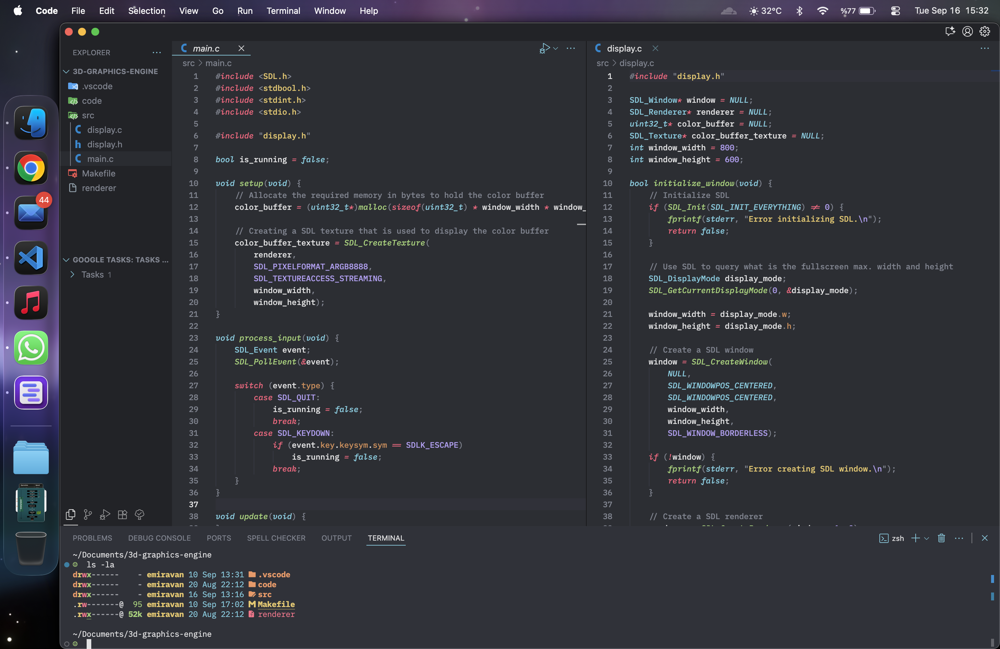
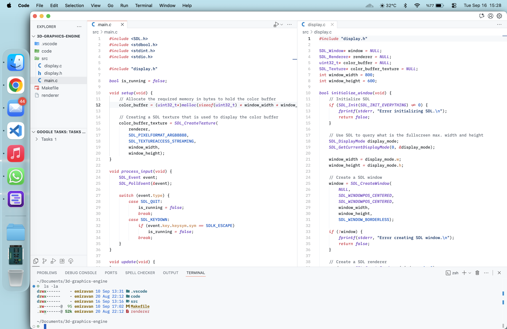
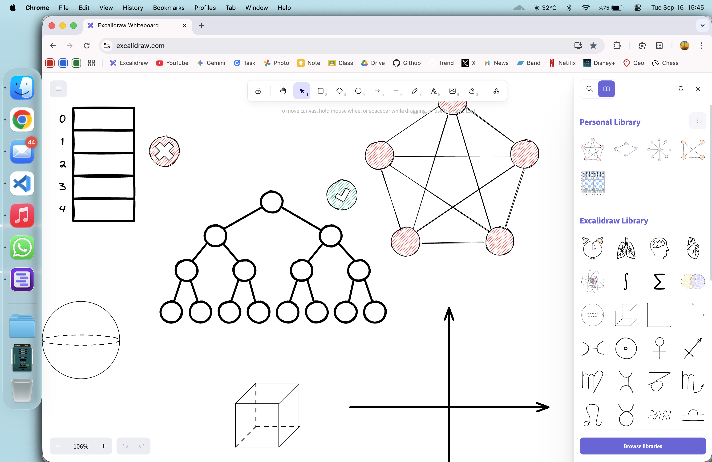

# Dotfiles




---

## Wallpapers

| Mode        | Wallpaper                                                                                 |
|-------------|------------------------------------------------------------------------------------------|
| **Dark**    | [macOS 10.5 Leopard](https://512pixels.net/downloads/macos-wallpapers-6k/10-6-6k.jpg)    |
| **Light**   | [Windows XP "Peace"](https://www.reddit.com/r/wallpaper/comments/j3ydml/i_remastered_my_favorite_windows_xp_wallaper/) |
| **Dynamic** | [`Extra/wallpaper.heic`](Extra/wallpaper.heic)                                           |

---

## 1. Prerequisites

### Oh My Zsh

```bash
sh -c "$(curl -fsSL https://raw.github.com/ohmyzsh/ohmyzsh/master/tools/install.sh)"
```

---

### Homebrew

```bash
/bin/bash -c "$(curl -fsSL https://raw.githubusercontent.com/Homebrew/install/HEAD/install.sh)"
```

---

## 2. Packages

### Homebrew Packages

#### CLI Tools

- [eza](https://github.com/eza-community/eza) &mdash; Modern replacement for `ls`.
- [fzf](https://github.com/junegunn/fzf) &mdash; Command-line fuzzy finder.
- [yazi](https://github.com/sxyazi/yazi) &mdash; Terminal file manager.
- [yt-dlp](https://github.com/yt-dlp/yt-dlp) &mdash; YouTube video downloader.
- [zoxide](https://github.com/ajeetdsouza/zoxide) &mdash; Smarter `cd` command.

---

#### Project Dependencies

The following packages are mainly used for my personal projects involving C++/OpenGL development:

- [cmake](https://cmake.org/) &mdash; Build automation tool.
- [glew](http://glew.sourceforge.net/) &mdash; OpenGL Extension Wrangler Library.
- [glow](https://github.com/grovesNL/glow) &mdash; Cross-platform OpenGL bindings.
- [sdl2](https://github.com/libsdl-org/SDL) &mdash; Simple DirectMedia Layer 2.
- [sdl2_image](https://github.com/libsdl-org/SDL_image) &mdash; Image loading library for SDL2.

---

#### To Install All

```bash
brew install cmake eza fzf glew glow sdl2 sdl2_image yazi yt-dlp zoxide
```

---

### Homebrew Cask Applications

- [blip](https://blip.net) &mdash; Cross platform file transfer.
- [cloudflare-warp](https://1.1.1.1/) &mdash; VPN.
- [discord](https://discord.com/) &mdash; Voice and text chat for communities.
- [font-lilex-nerd-font](https://github.com/mishamyrt/Lilex) &mdash; [IBM Plex Mono](https://www.ibm.com/plex/) with nerd icons and ligatures.
- [google-chrome](https://www.google.com/chrome/) &mdash; Browser.
- [iina](https://iina.io/) &mdash; Media player.
- [keka](https://www.keka.io/) &mdash; File archiver for macOS.
- [logi-options+](https://www.logitech.com/en-us/software/logi-options-plus.html) &mdash; Logitech customization.
- [microsoft-excel](https://www.microsoft.com/en-us/microsoft-365/excel) &mdash; Spreadsheet.
- [microsoft-powerpoint](https://www.microsoft.com/en-us/microsoft-365/powerpoint) &mdash; Presentation.
- [microsoft-word](https://www.microsoft.com/en-us/microsoft-365/word) &mdash; Word processor.
- [middleclick](https://middleclick.app/) &mdash; Middle mouse button via trackpad.
- [visual-studio-code](https://code.visualstudio.com/) &mdash; Code editor.
- [whatsapp](https://www.whatsapp.com/download) &mdash; Messaging.

---

#### To Install All

```bash
brew install --cask blip cloudflare-warp discord font-lilex-nerd-font google-chrome iina keka logi-options+ microsoft-excel microsoft-powerpoint microsoft-word middleclick visual-studio-code whatsapp
```

---

### App Store Applications

- [Texty](https://apps.apple.com/us/app/texty-for-google-messages/id1538996043?mt=12) &mdash; Google Messages client
- [Folder Preview](https://apps.apple.com/us/app/folder-preview/id6698876601?mt=12) &mdash; Folder content preview

---

## 3. Dotfiles

### Clone Repository

```bash
git clone https://github.com/emiravan/dot-files.git
cd dot-files
```

---

### Zsh Configuration

```bash
cp .zshrc ~/.zshrc
source ~/.zshrc
```

---

### VS Code Settings

```bash
cp Library/Application\ Support/Code/User/settings.json ~/Library/Application\ Support/Code/User/settings.json
cp Library/Application\ Support/Code/User/keybindings.json ~/Library/Application\ Support/Code/User/keybindings.json
```

---

### Cleanup

```bash
cd .. && rm -rf dotfiles
```

---

## 4. VS Code Extensions

### VIM !
- [Vim](https://marketplace.visualstudio.com/items?itemName=vscodevim.vim) — Vim keybindings for VS Code.

- To make the VS Code Vim extension work properly, run the following command 

```bash
defaults write com.microsoft.VSCode ApplePressAndHoldEnabled -bool false
```

---

### AI

- [GitHub Copilot](https://marketplace.visualstudio.com/items?itemName=github.copilot) — AI-powered code completion.
- [Intellicode](https://marketplace.visualstudio.com/items?itemName=visualstudioexptteam.vscodeintellicode) — AI-assisted code completions.
- [Intellicode API Usage Examples](https://marketplace.visualstudio.com/items?itemName=visualstudioexptteam.intellicode-api-usage-examples) — API usage examples powered by AI.

---

### UI

- [Sonokai](https://marketplace.visualstudio.com/items?itemName=sainnhe.sonokai) — Dark theme.
- [Github Theme](https://marketplace.visualstudio.com/items?itemName=GitHub.github-vscode-theme) — Light theme.
- [Material Icon Theme](https://marketplace.visualstudio.com/items?itemName=pkief.material-icon-theme) — File icon theme.
- [Todo Tree](https://marketplace.visualstudio.com/items?itemName=gruntfuggly.todo-tree) — Highlights TODOs, FIXMEs, etc.
- [Error Lens](https://marketplace.visualstudio.com/items?itemName=usernamehw.errorlens) — Highlights errors and warnings inline.

---

### Note-Taking & Productivity

- [Markdown All in One](https://marketplace.visualstudio.com/items?itemName=yzhang.markdown-all-in-one) — Markdown editing enhancements.
- [Markdown Preview Github Styles](https://marketplace.visualstudio.com/items?itemName=bierner.markdown-preview-github-styles) — GitHub-style markdown preview.
- [Markdown Mermaid](https://marketplace.visualstudio.com/items?itemName=bierner.markdown-mermaid) — Mermaid diagrams in markdown.
- [Markmap](https://marketplace.visualstudio.com/items?itemName=gera2ld.markmap-vscode) — Visualizes markdown as mindmaps.
- [Excalidraw Editor](https://marketplace.visualstudio.com/items?itemName=pomdtr.excalidraw-editor) — Excalidraw diagrams in VS Code.
- [Google Tasks for VSCode](https://marketplace.visualstudio.com/items?itemName=KrishnaPravin.google-tasks) — Manage Google Tasks directly in VS Code.

---

### Python

- [Python](https://marketplace.visualstudio.com/items?itemName=ms-python.python) — Python language support.
- [MagicPython](https://marketplace.visualstudio.com/items?itemName=magicstack.magicpython) — Improved Python syntax highlighting.
- [Jupyter](https://marketplace.visualstudio.com/items?itemName=ms-toolsai.jupyter) — Jupyter notebook support.
- [Data Wrangler](https://marketplace.visualstudio.com/items?itemName=ms-toolsai.datawrangler) — Data viewing tool.

---

### C/C++

- [CMake](https://marketplace.visualstudio.com/items?itemName=twxs.cmake) — CMake language support.
- [Makefile Tools](https://marketplace.visualstudio.com/items?itemName=ms-vscode.makefile-tools) — Makefile support.
- [C/C++ Extension Pack](https://marketplace.visualstudio.com/items?itemName=ms-vscode.cpptools-extension-pack) — Collection of C/C++ extensions.
- [C++ Snippets](https://marketplace.visualstudio.com/items?itemName=hars.cppsnippets) — Useful C++ code snippets.

---

### Formatters

- [Prettier - Code formatter](https://marketplace.visualstudio.com/items?itemName=esbenp.prettier-vscode) — Formatter.
- [42 Header](https://marketplace.visualstudio.com/items?itemName=kube.42header) — Adds 42 school header to files.
- [42 C Format](https://marketplace.visualstudio.com/items?itemName=keyhr.42-c-format) — C code formatter for 42 school.
- [Code Spell Checker](https://marketplace.visualstudio.com/items?itemName=streetsidesoftware.code-spell-checker) — Spell checker.
- [Code Spell Checker: Turkish](https://marketplace.visualstudio.com/items?itemName=streetsidesoftware.code-spell-checker-turkish) — Turkish language support for spell checker.
- [autopep8](https://marketplace.visualstudio.com/items?itemName=ms-python.autopep8) — Python code formatter.

---

## 5. VS Code Keybindings

Below is my custom [`keybindings`](Library/Application%20Support/Code/User/keybindings.json) for VS Code.  
> **Note:** Some default Vim keybindings are not used, and certain keys are reassigned for productivity. See below for updated keybinds.

| Key(s)         | Action / Command                                      | Description                |
|----------------|-------------------------------------------------------|----------------------------|
| `ctrl+t`       | Toggle Terminal                                       | [T]erminal                 |
| `ctrl+i`       | Toggle Chat                                           |                            |
| `ctrl-s`       | Toggle Sidebar                                        | [S]idebar                  |
| `ctrl+u`       | Scroll Up Half Page  Center Cursor                   |                            |
| `ctrl+d`       | Scroll Down Half Page + Center Cursor                 |                            |
| `f`            | Toggle Maximize Editor Group                          | [F]ullscreen (editor)      |
| `shift+f`      | Toggle Fullscreen Window                             | [F]ullscreen (window)      |
| `q`            | Save & Close Editor                                   | [Q]uit & save              |
| `shift+q`      | Close Other Editors                                   | [Q]uit others              |
| `t`            | Save Current File                                     | Wri[T]e file               |
| `shift+t`      | Save All Files                                        | Wri[T]e all                |
| `space c a`    | Code Action                                           | [C]ode [A]ction            |
| `space c r`    | Rename Symbol                                         | [C]ode [R]ename            |
| `space c s`    | Go to Symbol                                          | [C]ode [S]ymbol            |
| `space space`  | Quick Open                                            |                            |
| `space g d`    | Go to Definition                                      | [G]o to [D]efinition       |
| `space g r`    | Go to References                                      | [G]o to [R]eferences       |
| `space g i`    | Go to Implementation                                  | [G]o to [I]mplementation   |
| `shift-m`      | Previous Marker                                       | [M]arker previous          |
| `m`            | Next Marker                                           | [M]arker next              |
| `s`            | Split Editor / Markdown Preview / Open to Side        | [S]plit / [S]ide           |
| `shift-s`      | Split Editor Down / Mind Map / Open to Side           | [S]plit down / [S]ide      |
| `shift-k`      | Show Hover / Move Lines Up                            | [K]nowledge / Move up      |
| `shift-j`      | Move Lines Down                                       | Move down                  |
| `ctrl-h/l/k/j` | Navigate Left/Right/Up/Down Pane                      |                            |
| `tab`          | Next Tab / Suggestion / Quick Pick Next               |                            |
| `shift-tab`    | Previous Tab / Suggestion / Quick Pick Previous       |                            |
| `1`-`9`        | Open Tab at Index 1-9                                 |                            |
| `r`            | Rename File (Explorer) / Toggle Breakpoint            | [R]ename / b[R]eakpoint    |
| `shift-r`      | Start Debug                                           | [R]un                      |
| `c`            | Copy File (Explorer)                                  | [C]opy                     |
| `p`            | Paste File (Explorer)                                 | [P]aste                    |
| `x`            | Cut File (Explorer)                                   |                            |
| `d`            | Delete File (Explorer)                                | [D]elete                   |
| `a`            | New File (Explorer)                                   |                            |
| `shift-a`      | New Folder (Explorer)                                 |                            |
| `enter`        | Open File / Toggle Folder (Explorer)                  |                            |
| `n`            | Next Word Highlight / Debug Step Over                 | [N]ext highlight / step    |
| `shift+n`      | Previous Word Highlight / Debug Continue              | [N]ext breakpoint          |
| `escape`       | Stop Debug / Close Markers Navigation                 |                            |
| `ctrl-c`       | Stop Debug                                            |                            |

## 6. Chrome Extensions

- [Enhancer for Classroom](https://chromewebstore.google.com/detail/enhancer-for-classroom/nbijdallbnpfkkglpdepfjdlelflfkdc?hl=en) &mdash; Adds download buttons next to documents.
- [Material Icons for GitHub](https://chromewebstore.google.com/detail/material-icons-for-github/bggfcpfjbdkhfhfmkjpbhnkhnpjjeomc) &mdash; Adds Material icons to GitHub.
- [GitZip for GitHub](https://chrome.google.com/webstore/detail/gitzip-for-github/ffabmkklhbepgcgfonabamgnfafbdlkn) &mdash; Download files from GitHub repositories as zip files.
- [uBlock Origin Lite](https://chrome.google.com/webstore/detail/ublock-origin-lite/ddkjiahejlhfcafbddmgiahcphecmpfh) &mdash; Ad block.
- [SponsorBlock for YouTube](https://chrome.google.com/webstore/detail/sponsorblock-for-youtube/mnjggcdmjocbbbhaepdhchncahnbgone) &mdash; Skip sponsorships.
- [Google Keep Chrome Extension](https://chromewebstore.google.com/detail/google-keep-chrome-extens/lpcaedmchfhocbbapmcbpinfpgnhiddi?hl=en-US&utm_source=ext_sidebar) &mdash; Save notes to Google Keep.
- [Vimium](https://chrome.google.com/webstore/detail/vimium/dbepggeogbaibhgnhhndojpepiihcmeb) &mdash; Vim-style keyboard navigation.

<details>
<summary>Custom <a href="https://chrome.google.com/webstore/detail/vimium/dbepggeogbaibhgnhhndojpepiihcmeb">Vimium</a> key mappings</summary>

```
unmapAll
map j scrollPageDown
map k scrollPageUp
map <c-d> scrollPageDown
map <c-u> scrollPageUp
map gg scrollToTop
map G scrollToBottom
map e LinkHints.activateMode
map E LinkHints.activateModeToOpenInNewTab
map n performFind
map N performBackwardsFind
map b goBack
map w goForward
map o Vomnibar.activateBookmarks
map O Vomnibar.activateBookmarksInNewTab
map <tab> previousTab
map <s-tab> nextTab
map s createTab
map q removeTab
map Q restoreTab
map r reload
map y copyCurrentUrl
map ? enterFindMode
```
</details>

---

## 7. Bookmarks

- [Draw](https://excalidraw.com)
- [YouTube](https://youtube.com)
- [Gemini](https://gemini.google.com)
- [Task](https://tasks.google.com) — Google Tasks
- [Photo](https://photos.google.com) — Google Photos
- [Note](https://keep.google.com) — Google Keep
- [Class](https://classroom.google.com) — Google Classroom
- [Drive](https://drive.google.com) — Google Drive
- [GitHub](https://github.com)
- [Trend](https://github.com/trending?since=monthly) — GitHub Trending Repositories (Monthly)
- [News](https://hackerweb.app) — Hacker News
- [Band](https://bandcamp.com/discover) — Bandcamp
- [Netflix](https://netflix.com)
- [HBO](https://www.hbomax.com) — HBO Max
- [Disney+](https://disneyplus.com)
- [Geo](https://geoguessr.com) — GeoGuessr
- [Chess](https://lichess.org/) — Lichess
- [AI](https://huggingface.co) — Hugging Face
- [Instagram](https://instagram.com)
- [Kick](https://kick.com)
- [Reddit](https://reddit.com)
- [X](https://x.com)
- [BTK](https://www.btkakademi.gov.tr/portal) — BTK Akademi

---

## 8. Excalidraw

My Excalidraw library includes custom shapes and diagrams. You can add it to Excalidraw using the [`Extra/library.excalidrawlib`](Extra/library.excalidrawlib).



---

## 9. Shortcuts

- [OCR](https://www.icloud.com/shortcuts/5e3090a8d4b0457da506f48e745a2028) — Copies text from the screen.

> I recommend assigning the shortcut to `Cmd + Shift + 2` for quick access.

---
