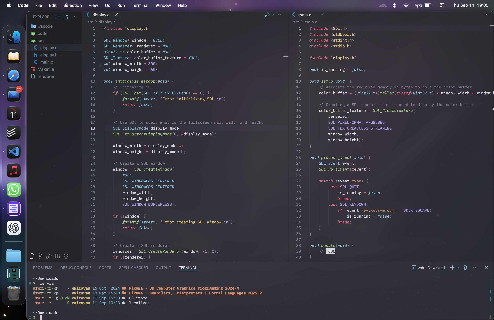
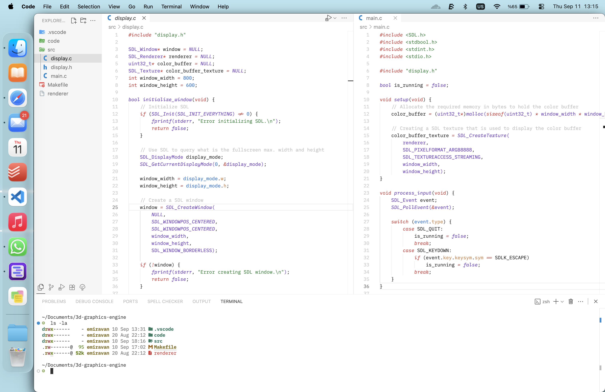
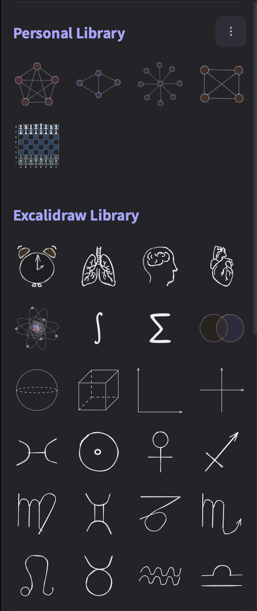

# Dotfiles

Dotfiles and tools I prepared for personal use.

<p align="center">
    
    
</p>

---

## Wallpapers

| Mode        | Wallpaper                                                                                 |
|-------------|------------------------------------------------------------------------------------------|
| **Dark**    | [macOS 10.5 Leopard](https://512pixels.net/downloads/macos-wallpapers-6k/10-6-6k.jpg)    |
| **Light**   | [Windows XP "Peace"](https://www.reddit.com/r/wallpaper/comments/j3ydml/i_remastered_my_favorite_windows_xp_wallaper/) |
| **Dynamic** | [`Extra/wallpaper.heic`](Extra/wallpaper.heic)                                           |

---

## 1. Prerequisites

### Oh My Zsh

```bash
sh -c "$(curl -fsSL https://raw.github.com/ohmyzsh/ohmyzsh/master/tools/install.sh)"
```

### Homebrew

```bash
/bin/bash -c "$(curl -fsSL https://raw.githubusercontent.com/Homebrew/install/HEAD/install.sh)"
```

---

## 2. Packages

### Homebrew Packages

#### CLI Tools

- [eza](https://github.com/eza-community/eza) &mdash; Modern replacement for `ls`.
- [fzf](https://github.com/junegunn/fzf) &mdash; Command-line fuzzy finder.
- [yazi](https://github.com/sxyazi/yazi) &mdash; Terminal file manager.
- [yt-dlp](https://github.com/yt-dlp/yt-dlp) &mdash; YouTube video downloader.
- [zoxide](https://github.com/ajeetdsouza/zoxide) &mdash; Smarter `cd` command.

#### Project Dependencies

The following packages are mainly used for my personal projects involving C++/OpenGL development:

- [cmake](https://cmake.org/) &mdash; Build automation tool.
- [glew](http://glew.sourceforge.net/) &mdash; OpenGL Extension Wrangler Library.
- [glow](https://github.com/grovesNL/glow) &mdash; Cross-platform OpenGL bindings.
- [sdl2](https://github.com/libsdl-org/SDL) &mdash; Simple DirectMedia Layer 2.
- [sdl2_image](https://github.com/libsdl-org/SDL_image) &mdash; Image loading library for SDL2.

#### To Install All

```bash
brew install cmake eza fzf glew glow sdl2 sdl2_image yazi yt-dlp zoxide
```

---

### Homebrew Cask Applications

- [blip](https://blip.net) &mdash; Cross platform file transfer.
- [chatgpt](https://chatgpt.com/features/desktop/) &mdash; ChatGPT desktop client.
- [cloudflare-warp](https://1.1.1.1/) &mdash; VPN.
- [discord](https://discord.com/) &mdash; Voice and text chat for communities.
- [fliqlo](https://fliqlo.com/) &mdash; Flip clock screensaver.
- [font-lilex-nerd-font](https://github.com/mishamyrt/Lilex) &mdash; Developer-friendly font.
- [iina](https://iina.io/) &mdash; Modern media player for macOS.
- [keka](https://www.keka.io/) &mdash; File archiver for macOS.
- [logi-options+](https://www.logitech.com/en-us/software/logi-options-plus.html) &mdash; Logitech device customization.
- [microsoft-excel](https://www.microsoft.com/en-us/microsoft-365/excel) &mdash; Spreadsheet software.
- [microsoft-powerpoint](https://www.microsoft.com/en-us/microsoft-365/powerpoint) &mdash; Presentation software.
- [microsoft-word](https://www.microsoft.com/en-us/microsoft-365/word) &mdash; Word processor.
- [middleclick](https://middleclick.app/) &mdash; Middle mouse button emulation.
- [todoist-app](https://todoist.com/) &mdash; Task manager.
- [visual-studio-code](https://code.visualstudio.com/) &mdash; Code editor.
- [whatsapp](https://www.whatsapp.com/download) &mdash; Messaging app.

#### To Install All

```bash
brew install --cask blip chatgpt cloudflare-warp discord fliqlo font-lilex-nerd-font iina keka logi-options+ microsoft-excel microsoft-powerpoint microsoft-word middleclick todoist-app visual-studio-code whatsapp
```

---

### App Store Applications

- [Texty](https://apps.apple.com/us/app/texty-for-google-messages/id1538996043?mt=12) &mdash; Google Messages client
- [Folder Preview](https://apps.apple.com/us/app/folder-preview/id6698876601?mt=12) &mdash; Folder content preview

---

## 3. Dotfiles

### Clone Repository

```bash
git clone https://github.com/emiravan/dot-files.git
cd dot-files
```

### Zsh Configuration

```bash
cp .zshrc ~/.zshrc
source ~/.zshrc
```

### VS Code Settings

```bash
cp vscode/settings.json ~/Library/Application\ Support/Code/User/settings.json
cp vscode/keybindings.json ~/Library/Application\ Support/Code/User/keybindings.json
```

### Cleanup

```bash
cd .. && rm -rf dot-files
```

## 4. VS Code Extensions

### VIM !
- [Vim](https://marketplace.visualstudio.com/items?itemName=vscodevim.vim) — Vim keybindings for VS Code.

- To make the VS Code Vim extension work properly, run the following command 

```bash
defaults write com.microsoft.VSCode ApplePressAndHoldEnabled -bool false
```

### AI

- [GitHub Copilot](https://marketplace.visualstudio.com/items?itemName=github.copilot) — AI-powered code completion.
- [Intellicode](https://marketplace.visualstudio.com/items?itemName=visualstudioexptteam.vscodeintellicode) — AI-assisted code completions.
- [Intellicode API Usage Examples](https://marketplace.visualstudio.com/items?itemName=visualstudioexptteam.intellicode-api-usage-examples) — API usage examples powered by AI.

### UI

- [Sonokai](https://marketplace.visualstudio.com/items?itemName=sainnhe.sonokai) — Colorful dark theme.
- [Min Theme](https://marketplace.visualstudio.com/items?itemName=miguelsolorio.min-theme) — Minimal VS Code theme.
- [Material Icon Theme](https://marketplace.visualstudio.com/items?itemName=pkief.material-icon-theme) — File icon theme.
- [Todo Tree](https://marketplace.visualstudio.com/items?itemName=gruntfuggly.todo-tree) — Highlights TODOs, FIXMEs, etc.
- [Error Lens](https://marketplace.visualstudio.com/items?itemName=usernamehw.errorlens) — Highlights errors and warnings inline.
- [Typing Sounds](https://marketplace.visualstudio.com/items?itemName=mtuan.typing-sounds) — Adds keyboard sounds.
- [VSCode Animations](https://marketplace.visualstudio.com/items?itemName=brandonkirbyson.vscode-animations) — Adds animations to VS Code.
- [Custom UI Style](https://marketplace.visualstudio.com/items?itemName=subframe7536.custom-ui-style) — Customizes VS Code UI.
> **Note For Custom UI Style:**  
> To hide the top bar in VS Code, you can enable the relevant setting (currently commented out) in [settings.json](Library/Application%20Support/Code/User/settings.json)

### Note-Taking

- [Markdown All in One](https://marketplace.visualstudio.com/items?itemName=yzhang.markdown-all-in-one) — Markdown editing enhancements.
- [Markdown Preview Github Styles](https://marketplace.visualstudio.com/items?itemName=bierner.markdown-preview-github-styles) — GitHub-style markdown preview.
- [Markdown Mermaid](https://marketplace.visualstudio.com/items?itemName=bierner.markdown-mermaid) — Mermaid diagrams in markdown.
- [Markmap](https://marketplace.visualstudio.com/items?itemName=gera2ld.markmap-vscode) — Visualizes markdown as mindmaps.
- [Excalidraw Editor](https://marketplace.visualstudio.com/items?itemName=pomdtr.excalidraw-editor) — Excalidraw diagrams in VS Code.

### Python

- [Python](https://marketplace.visualstudio.com/items?itemName=ms-python.python) — Python language support.
- [MagicPython](https://marketplace.visualstudio.com/items?itemName=magicstack.magicpython) — Improved Python syntax highlighting.
- [Jupyter](https://marketplace.visualstudio.com/items?itemName=ms-toolsai.jupyter) — Jupyter notebook support.
- [Data Wrangler](https://marketplace.visualstudio.com/items?itemName=ms-toolsai.datawrangler) — Data cleaning and transformation tool.

### C/C++

- [CMake](https://marketplace.visualstudio.com/items?itemName=twxs.cmake) — CMake language support.
- [Makefile Tools](https://marketplace.visualstudio.com/items?itemName=ms-vscode.makefile-tools) — Makefile support.
- [C/C++ Extension Pack](https://marketplace.visualstudio.com/items?itemName=ms-vscode.cpptools-extension-pack) — Collection of C/C++ extensions.
- [C++ Snippets](https://marketplace.visualstudio.com/items?itemName=hars.cppsnippets) — Useful C++ code snippets.

### Formatters

- [Prettier - Code formatter](https://marketplace.visualstudio.com/items?itemName=esbenp.prettier-vscode) — Formatter.
- [42 Header](https://marketplace.visualstudio.com/items?itemName=kube.42header) — Adds 42 school header to files.
- [42 C Format](https://marketplace.visualstudio.com/items?itemName=keyhr.42-c-format) — C code formatter for 42 school.
- [Code Spell Checker](https://marketplace.visualstudio.com/items?itemName=streetsidesoftware.code-spell-checker) — Spell checker.
- [Code Spell Checker: Turkish](https://marketplace.visualstudio.com/items?itemName=streetsidesoftware.code-spell-checker-turkish) — Turkish language support for spell checker.
- [autopep8](https://marketplace.visualstudio.com/items?itemName=ms-python.autopep8) — Python code formatter.

---

## 5. VS Code Keybindings

Below is a my custom keybindings for VS Code

> **Note:** I do not use some default Vim keybindings, so I have reassigned certain keys to other actions. There may still be mistakes or inconsistencies in the keybindings listed above.

| Key(s)         | Action / Command                                      | Description                |
|----------------|-------------------------------------------------------|----------------------------|
| `ctrl+t`       | Toggle Terminal                                       | [T]erminal                 |
| `ctrl+i`       | Toggle Chat                                           |                            |
| `ctrl-s`       | Toggle Sidebar                                        | [S]idebar                  |
| `ctrl+u`       | Scroll Up Half Page + Center Cursor                   |                            |
| `ctrl+d`       | Scroll Down Half Page + Center Cursor                 |                            |
| `q`            | Save & Close Editor                                   | [Q]uit & save              |
| `f`            | Toggle Maximize Editor Group                          | [F]ullscreen               |
| `space c a`    | Code Action                                           | [C]ode [A]ction            |
| `space c r`    | Rename Symbol                                         | [C]ode [R]ename            |
| `space c s`    | Go to Symbol                                          | [C]ode [S]ymbol            |
| `space space`  | Quick Open                                            |                            |
| `space g d`    | Go to Definition                                      | [G]o to [D]efinition       |
| `space g r`    | Go to References                                      | [G]o to [R]eferences       |
| `space g i`    | Go to Implementation                                 | [G]o to [I]mplementation   |
| `shift-m`      | Previous Marker                                       | [M]arker previous          |
| `m`            | Next Marker                                           | [M]arker next              |
| `s`            | Split Editor                                          | [S]plit                    |
| `shift-s`      | Split Editor Down                                     | [S]plit down               |
| `shift-k`      | Show Hover / Move Lines Up                            | [K]nowledge / Move up      |
| `shift-j`      | Move Lines Down                                       | Move down                  |
| `ctrl-h/l/k/j` | Navigate Left/Right/Up/Down Pane                      |                            |
| `tab`          | Next Tab / Suggestion                                 |                            |
| `shift-tab`    | Previous Tab / Suggestion                             |                            |
| `1`-`9`        | Open Tab at Index 1-9                                 |                            |
| `r`            | Rename File (Explorer)                                | [R]ename                   |
| `c`            | Copy File (Explorer)                                  | [C]opy                     |
| `p`            | Paste File (Explorer)                                 | [P]aste                    |
| `x`            | Cut File (Explorer)                                   |                            |
| `d`            | Delete File (Explorer)                                | [D]elete                   |
| `a`            | New File (Explorer)                                   |                            |
| `shift-a`      | New Folder (Explorer)                                 |                            |
| `s`            | Open to Side (Explorer)                               | [S]ide                     |
| `shift-s`      | Split Down & Open (Explorer)                          | [S]ide                     |
| `enter`        | Open File / Toggle Folder (Explorer)                  |                            |
| `n`            | Next Word Highlight / Debug Step Over                 | [N]ext step                |
| `shift+n`      | Previous Word Highlight / Debug Continue              | [N]ext breakpoint          |
| `t`            | Markdown Preview / Toggle Breakpoint                  | [T]oggle preview / [T]ag   |
| `m`            | Markmap Mind Map                                      | [M]ind map                 |
| `escape`       | Stop Debug / Close Markers Navigation                 |                            |
| `ctrl-c`       | Stop Debug                                            |                            |
| `r`            | Start Debug                                           | [R]un                      |
| `shift-r`      | Select & Start Debug                                  | [R]un                      |

**Markdown-specific:**
- `t` in markdown: Toggle preview
- `m` in markdown: Open mind map

**Vim Search:**
- `n` / `shift+n`: Next/Previous word highlight

**File Explorer:**
- `r`, `c`, `p`, `x`, `d`, `a`, `shift-a`, `s`, `shift-s`, `enter`: File operations

**Tabs:**
- `tab`, `shift-tab`, `1`-`9`: Tab navigation

**Debugging:**
- `t`, `r`, `shift-r`, `escape`, `ctrl-c`, `n`, `shift+n`: Debug actions

> See `keybindings.json` for full details and context conditions.

## 6. Browser Extensions

### Safari

- [Octotree](https://apps.apple.com/us/app/octotree/id1457450145?mt=12) &mdash; GitHub code tree navigation enhancement.
- [SponsorBlock for Safari](https://apps.apple.com/us/app/sponsorblock-for-safari/id1573461917) &mdash; Skip sponsorships on YouTube videos.
- [uBlock Origin Lite](https://apps.apple.com/us/app/ublock-origin-lite/id6745342698) &mdash; Ad Block.
- [Vimlike](https://apps.apple.com/us/app/vimlike/id1584519802) &mdash; Vim-style keyboard navigation.

<details>
<summary>Custom <a href="https://apps.apple.com/us/app/vimlike/id1584519802">Vimlike</a> key mappings</summary>

```js
settings.map('j', VLCommand.SCROLL_DOWN);
settings.map('k', VLCommand.SCROLL_UP);
settings.map('ctrl+d', VLCommand.HALF_PAGE_DOWN);
settings.map('ctrl+u', VLCommand.HALF_PAGE_UP);
settings.map('g g', VLCommand.SCROLL_TO_TOP);
settings.map('shift+g', VLCommand.SCROLL_TO_BOTTOM);
settings.map('e', VLCommand.ACTIVATE_LINK);
settings.map('shift+e', VLCommand.ACTIVATE_LINK_WITH_NEW_TAB);
settings.map('n', VLCommand.NEXT_LINK);
settings.map('shift+n', VLCommand.PREV_LINK);
settings.map('b', VLCommand.GO_BACK);
settings.map('w', VLCommand.GO_FORWARD);
settings.map('shift+tab', VLCommand.PREV_TAB);
settings.map('tab', VLCommand.NEXT_TAB);
settings.map('t', VLCommand.NEW_TAB);
settings.map('i', VLCommand.FOCUS_INPUT);
settings.map('?', VLCommand.SHOW_CONSOLE);
settings.map('1', VLCommand.OPEN_TAB1);
settings.map('2', VLCommand.OPEN_TAB2);
settings.map('3', VLCommand.OPEN_TAB3);
settings.map('4', VLCommand.OPEN_TAB4);
settings.map('5', VLCommand.OPEN_TAB5);
settings.map('6', VLCommand.OPEN_TAB6);
settings.map('7', VLCommand.OPEN_TAB7);
settings.map('8', VLCommand.OPEN_TAB8);
settings.map('9', VLCommand.OPEN_TAB9);
settings.map('q', VLCommand.CLOSE_TAB);
settings.map('r', VLCommand.RELOAD);
settings.map('y', VLCommand.COPY_CURRENT_URL);
settings.map('o', VLCommand.SHOW_COMMAND_BAR);
settings.map('ctrl+c', VLCommand.NORMAL_MODE);
```
</details>

---

### Chromium

- [uBlock Origin Lite](https://chrome.google.com/webstore/detail/ublock-origin-lite/ddkjiahejlhfcafbddmgiahcphecmpfh) &mdash; Efficient ad blocking.
- [GitZip for GitHub](https://chrome.google.com/webstore/detail/gitzip-for-github/ffabmkklhbepgcgfonabamgnfafbdlkn) &mdash; Download files from GitHub repositories as zip files.
- [SponsorBlock for YouTube](https://chrome.google.com/webstore/detail/sponsorblock-for-youtube/mnjggcdmjocbbbhaepdhchncahnbgone) &mdash; Skip sponsorships on YouTube videos.
- [Octotree - GitHub code tree](https://chrome.google.com/webstore/detail/octotree-github-code-tree/bkhaagjahfmjljalopjnoealnfndnagc) &mdash; GitHub code tree navigation enhancement.
- [Vimium](https://chrome.google.com/webstore/detail/vimium/dbepggeogbaibhgnhhndojpepiihcmeb) &mdash; Vim-style keyboard navigation.

<details>
<summary>Custom <a href="https://chrome.google.com/webstore/detail/vimium/dbepggeogbaibhgnhhndojpepiihcmeb">Vimium</a> key mappings</summary>

```
unmapAll
map j scrollPageDown
map k scrollPageUp
map <c-d> scrollPageDown
map <c-u> scrollPageUp
map gg scrollToTop
map G scrollToBottom
map e LinkHints.activateMode
map E LinkHints.activateModeToOpenInNewTab
map n performFind
map N performBackwardsFind
map b goBack
map w goForward
map o Vomnibar.activateBookmarks
map O Vomnibar.activateBookmarksInNewTab
map <tab> nextTab
map <s-tab> previousTab
map t createTab
map q removeTab
map Q restoreTab
map r reload
map y copyCurrentUrl
map ? enterFindMode
```
</details>

---

## 7. Excalidraw Library

With the [Excalidraw extension](https://marketplace.visualstudio.com/items?itemName=pomdtr.excalidraw-editor) in VS Code, I use [my own Excalidraw library](Extra/library.excalidrawlib) to work with Excalidraw more efficiently.

<p align="center">
    
</p>

